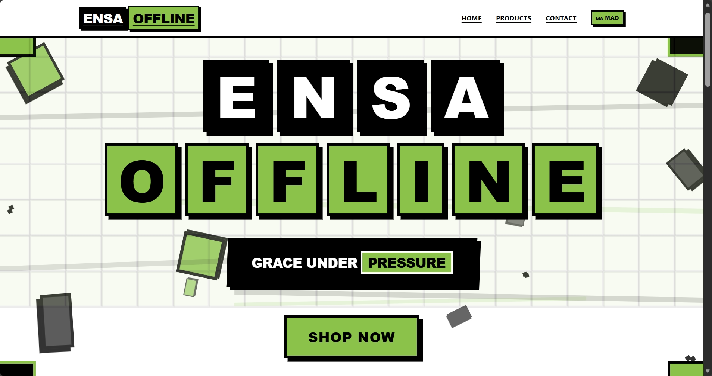
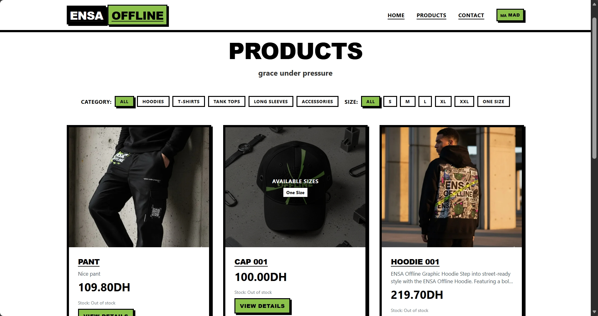
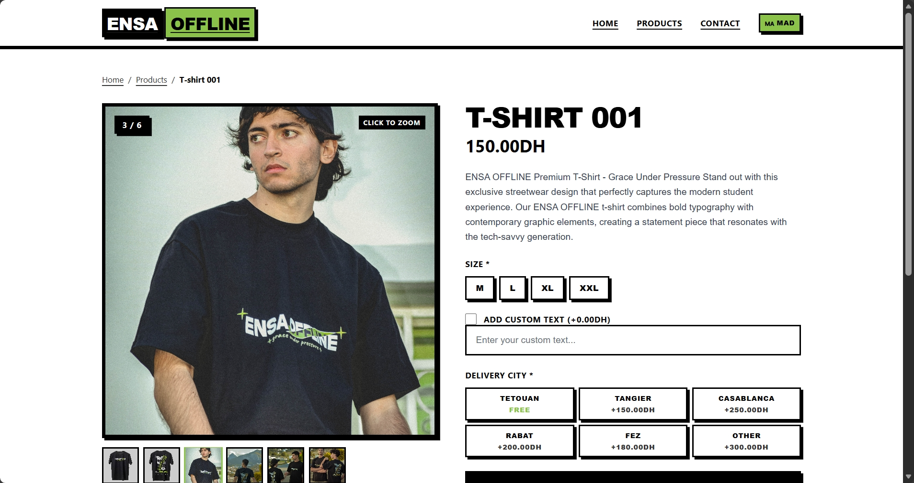
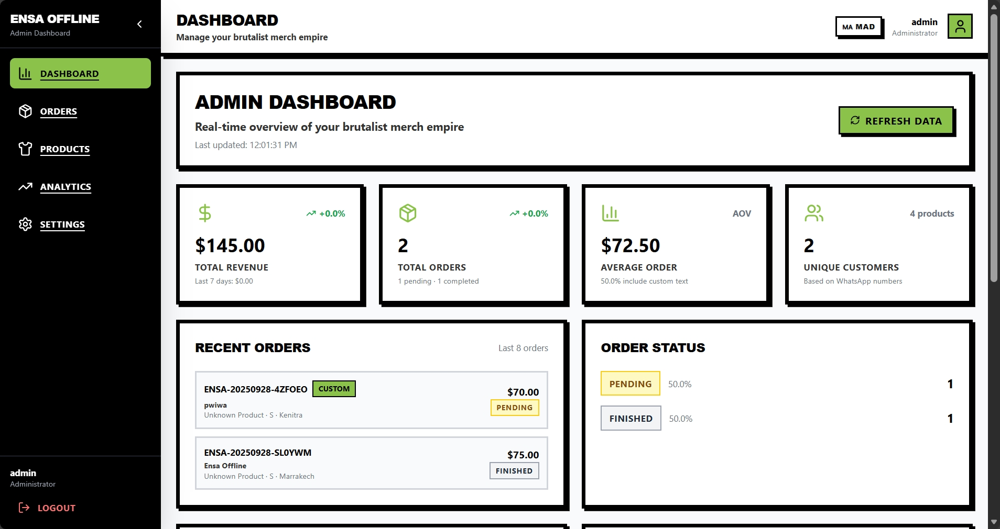
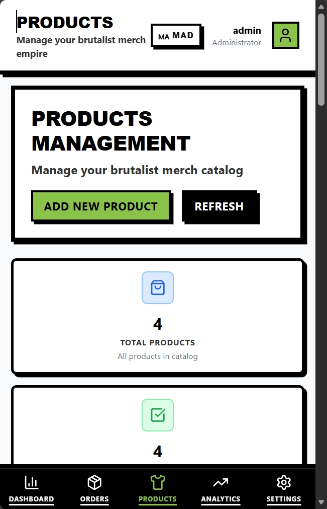

# ENSA OFFLINE · Brutalist Commerce System

> Graffiti energy, GSAP choreography, and a data-obsessed admin OS—built with Next.js 14, TypeScript, Tailwind CSS, and MongoDB.



<div align="center">

[](https://nextjs.org/)
[](https://greensock.com/gsap/)
[](https://tailwindcss.com/)
[](https://www.mongodb.com/)

</div>

---

## 🔥 Experience Highlights

- **Immersive landing funnel** – glitch typography, GSAP ripple CTA, hero video spotlight.
- **Product storytelling** – animated grid filters, zoom-on-hover galleries, live pricing chips.
- **Checkout intelligence** – Moroccan city-aware shipping, custom text upsells, cinematic confirmation page.
- **Admin command center** – dual-view orders cockpit, analytics tiles, CSV/HTML exports, toast rail.
- **Performance + polish** – Next.js streaming, image optimization, handcrafted brutalist tokens.

---

## 📸 Visual Tour

### Landing Flow · Hero Takeover

- Staggered headline animation + graffiti typographic stack.
- Auto-hiding nav and magnetic CTA with ripple loaders.

### Catalog Grid · Product Discovery

- GSAP-staggered product cards with hover lift + quick filter pills.
- Responsive grid that keeps pricing + CTA in view on all breakpoints.

### Product Detail · Customization UX

- Zoomable gallery, size selector, custom text upsell, live total chips.
- Shipping estimator drives transparency before checkout.

### Admin Dashboard · Desktop Suite

- Orders cards + table hybrid, analytics pulse tiles, status filters, brutalist toasts.
- Export controls (CSV + styled HTML) and protected session handling.

### Admin On-The-Go · Mobile Snapshot

- Mobile-responsive admin layout keeps KPI tiles + order management usable on phones.
- Sticky action bar for quick updates in the field.

---

## 🧩 Feature Matrix

| Layer | Highlights |
| --- | --- |
| Customer Journey | Animated hero, GSAP product grid, product detail customization, Moroccan shipping matrix, cinematic confirmation |
| Admin OS | Auth wall, orders cockpit (cards + tables + exports), product lab, pricing + settings console, analytics lens |
| Experience System | Tailwind brutalist tokens, Lucide icons, graffiti typography, GSAP micro-interactions, mobile-first layouts |

---

## 🛠 Tech Stack

- **Framework**: Next.js 14 App Router, TypeScript, React Server Components.
- **Styling**: Tailwind CSS with custom brutalist utilities (`shadow-brutal*`, `border-6`, `font-display`).
- **Animations**: GSAP + ScrollTrigger via `useGSAP` hook and animation preset library.
- **Data**: MongoDB + Mongoose models (Product, Order, Settings, CommunityText, UserProgress).
- **State/Auth**: React Context (auth + currency), session storage hydration, `/api/auth/*`.
- **Tooling**: Next Image optimization, Lucide React icons, SEO helpers, upload pipeline, seed scripts.

---

## 🧭 Architecture Atlas

```
src/
├─ app/
│  ├─ (public) hero, catalog, product/[id], order/[id], confirmation, contact
│  ├─ admin/ dashboard, orders, products, analytics, settings, login
│  ├─ api/ products, orders, settings, upload, auth, seed, utilities
│  └─ fonts + globals (brutalist tokens, typography)
├─ components/
│  ├─ marketing UI (Hero, ProductShowcase, AnimationShowcase, Footer…)
│  ├─ admin suite (AdminLayout, Tabs, ProtectedRoute, brutalist loaders)
│  └─ SEO helpers + GSAP primitives
├─ contexts/ AuthContext, CurrencyContext
├─ lib/ animation presets, Mongo driver, utils, performance helpers
└─ models/ Product, Order, Settings, CommunityText, CustomizeText, UserProgress
```

---

## 🔐 Admin Control Room

- **Orders cockpit** – kanban cards + sortable tables, status filters, exports with timestamps.
- **Product lab** – manage inventory, featured products, custom text pricing, activation toggles.
- **Settings console** – shipping fee matrix per Moroccan city, ordering kill switch, branding tweaks.
- **Analytics** – revenue velocity, funnel breakdown, KPI tiles with GSAP entrance animations.
- **UX layer** – click-outside modals, toast rail, protected routes, responsive layouts.

---

## 🚀 Quickstart

```bash
git clone <repo-url>
cd ensaoffline
npm install
cp .env.example .env.local  # or create manually
npm run dev
# open http://localhost:3000
```

`.env.local`
```
MONGODB_URI=mongodb://localhost:27017/ensaoffline
MONGODB_DB=ensaoffline
```

---

## 🧱 Motion + Design Language

- **Hero & CTA** – character-by-character entrance, glitch overlays, ripple CTA pulse.
- **Product cards** – hover lift, detail slide, price accent flash.
- **Order form** – focus swing, validation haptics, live total counter.
- **Admin modules** – route fade, modal bounce, toast rail slide-in, GSAP staggered tables.
- **Tokens/Palette** – #8BC34A, #000, #fff, #333, uppercase tracking, thick borders, brutalist drop shadows.

---

## 🔌 API Surface + Data Contracts

| Domain | Routes |
| --- | --- |
| Products | `GET/POST /api/products`, `GET/PATCH/DELETE /api/products/[id]` |
| Orders | `GET/POST /api/orders`, `GET/PATCH/DELETE /api/orders/[id]` |
| Settings | `GET/POST /api/settings`, `DELETE /api/settings/reset` |
| Auth | `POST /api/auth/login`, `POST /api/auth/logout`, `GET /api/auth/me` |
| Utilities | `/api/upload`, `/api/seed`, `/api/community-text`, `/api/test*` |

```typescript
// Product
{
  name: string;
  description: string;
  price: number;
  images: string[];
  sizes: string[];
  category: string;
  isCustomizable: boolean;
  customPrice: number;
  isActive: boolean;
  createdAt: Date;
  updatedAt: Date;
}

// Order
{
  orderId: string;
  customerInfo: {
    fullName: string;
    whatsappNumber: string;
    city: string;
    isTetouan: boolean;
  };
  productDetails: {
    productId: string;
    size: string;
    isCustom: boolean;
    customText?: string;
  };
  pricing: {
    basePrice: number;
    customFee: number;
    shippingFee: number;
    totalPrice: number;
  };
  status: 'pending' | 'contacted' | 'printed' | 'delivering' | 'delivered' | 'finished';
  createdAt: Date;
  updatedAt: Date;
}

// Settings
{
  shippingFees: Map<string, number>;
  customTextPrice: number;
  isOrderingEnabled: boolean;
  createdAt: Date;
  updatedAt: Date;
}
```

---

---

**ENSA OFFLINE** — brutalist energy engineered for merch drops under pressure.  
© 2025 ENSA Offline. All rights reserved. Crafted as a personal passion project with a lot of love, caffeine, graffiti dreams, and plenty of 🤍💚.